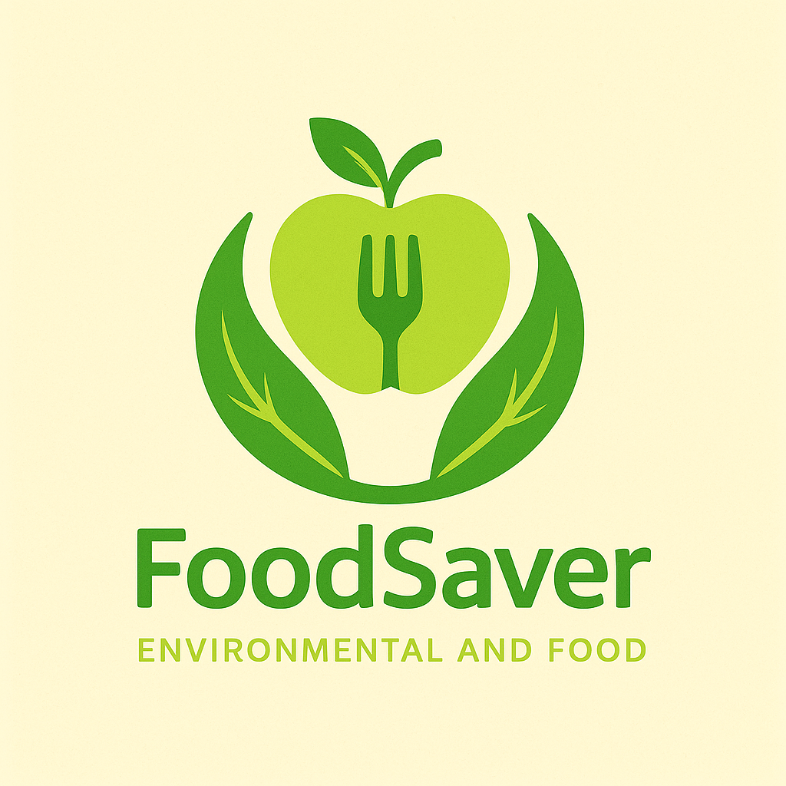

<h1 align="center">
 Food Saver
</h1>

<div align="center">
  
</div>

<h1 align="center">
 Food Saver
</h1>

<p align="center">
Food Saver adalah sebuah platform digital yang bertujuan untuk mengurangi masalah sampah makanan dengan cara yang inovatif dan berkelanjutan. Website ini menjadi penghubung antara pelaku usaha makanan (seperti restoran, kafe, katering, atau toko roti) dengan konsumen yang peduli lingkungan.

Melalui Food Saver, makanan sisa yang masih layak konsumsi — namun tidak lagi bisa dijual dengan harga normal karena alasan estetika atau waktu penyajian — ditawarkan kepada masyarakat dengan harga yang jauh lebih murah. Misi kami adalah mengurangi pemborosan makanan, memberdayakan pelaku usaha makanan, serta memberikan akses makanan terjangkau bagi masyarakat luas.

Tidak hanya sebagai marketplace, Food Saver juga berperan sebagai media edukasi tentang kesadaran pangan, keamanan makanan, dan gaya hidup berkelanjutan. Dengan menggunakan Food Saver, setiap pengguna turut berkontribusi dalam upaya menciptakan sistem pangan yang lebih adil, efisien, dan ramah lingkungan.

</p>

<p align="center">
    <a href="#">
      
    </a>
    <a href="#">
      
    </a>
</p>

---

## 🌐 Akses Demo & Akun Pengujian

Untuk mempermudah juri/penguji, kami telah menyediakan prototipe yang dapat diakses secara online serta akun demo.

- **Link Demo**: `[https://foodsave-two.vercel.app/]` (optional)
- **Link Postman / Dokumentasi API** : `[On Progress]`


---

## ✨ Tampilan Web

<p align="center">
  
  
  
</p>

---

## 📝 Status Prototipe

Repositori ini berisi prototipe untuk proyek final. Tidak semua fitur yang tercantum dalam deskripsi telah diimplementasikan sepenuhnya. Fokus kami untuk fase ini adalah menghadirkan fungsionalitas inti yang solid.

**Fitur yang Sudah Diimplementasikan:**

- [x] Landing Page
- [x] User Profile
- [x] Pemesanan
- [x] Manajemen Makanan bagi penjual
- [x] Daftar Sebagai penjual
- [ ] Login & Register
- [ ] Dashboard Admin
- [ ] Maps

---

## 🌟 Fitur Aplikasi

Berikut adalah fitur-fitur yang kami rencanakan untuk Seimbang.in:

### 1. Fitur Registrasi & Login Pengguna

### 2. Dashboard Penjual: Tambah, edit, dan hapus produk makanan

### 3. Fitur Pembelian Makanan Murah oleh Pembeli

### 4. Statistik Makanan Terselamatkan dari Pemborosan


---

## 🛠️ Tech Stack

- **Frontend**: `[React, TypeScript]`
- **Backend**: `[Laravel (On progress)]`
- **Database**: `[Mysql]`
- **Lainnya**: `[TailwindCSS, Filament]`

---

## 🚀 Cara Menjalankan Proyek Secara Lokal

### Pre-requisite

- Node.js (v18++)
- npm atau yarn
- Git

<!-- ### Backend (PHP Laravel)

1.  **Clone repositori ini:**

    ```bash
    git clone [https://github.com/username/nama-repo.git](https://github.com/username/nama-repo.git)
    cd nama-repo
    ```

2.  **Install dependency via Composer:**

    ```bash
    composer install
    ```

3.  **Salin file environment:**

    ```bash
    cp .env.example .env
    ```

4.  **Generate application key:**

    ```bash
    php artisan key:generate
    ```

5.  **Konfigurasi database di file `.env` kamu.**

6.  **Jalankan migrasi database:**

    ```bash
    php artisan migrate
    ```

7.  **Jalankan server lokal:**
    ```bash
    php artisan serve
    ```
    Backend akan berjalan di `http://localhost:8000`.

--- -->

### Frontend (Tailwind CLI)

<!-- 1.  **Pindah ke direktori frontend (jika terpisah):**

    ```bash
    # Jika frontend berada di folder terpisah, pindah ke folder tersebut
    # Contoh: cd ../frontend
    ``` -->

1.  **Install dependency Node.js:**

    ```bash
    npm install
    ```

2.  **Jalankan Tailwind CLI untuk memantau dan build CSS:**
    ```bash
    npm run watch
    ```

---

## 👨‍💻 Tim Kami

- Fauzun Naja 
- Handy Bryan Yudishtira
- Muhammad Danil

---
